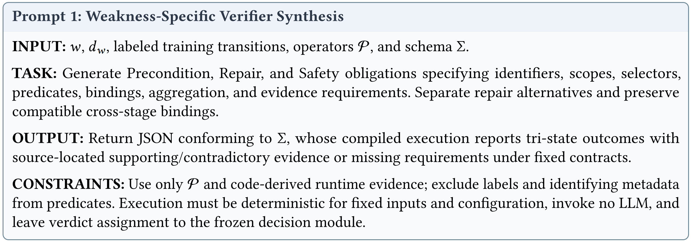

# 🛠️ WISE-Fix Replication Package

> **WISE-Fix: Identifying Silent Security Patches via Weakness-Informed Executable Verification**


This repository provides the replication materials for WISE-Fix, covering dataset preparation, baseline comparisons, verifier construction, online detection, and evaluation. The package is under preparation; runnable commands will be added alongside the corresponding implementations.

## 🧭 1. Framework Overview

WISE-Fix identifies silent vulnerability-fixing patches by linking evidence across the **pre-patch state**, **code change**, and **post-patch state**.

- **Offline:** An LLM uses CWE specifications and labeled training transitions to synthesize weakness-specific Precondition, Repair, and Safety obligations from fixed analysis operators. Accepted suites are validated, frozen, and versioned.
- **Online:** Frozen verifiers examine candidate patches and use bounded commit-group search when required evidence remains unresolved.
- **Output:** Each candidate receives a **Verified**, **Rejected**, or **Inconclusive** verdict with traceable evidence. Only Verified candidates are ranked.

**Online detection uses no LLM inference or rule adaptation.**

## 📊 2. Datasets

We evaluate WISE-Fix on **PatchDB\*** and **SPI-DB\***, the repository-level benchmarks introduced by RepoSPD. Both include security and non-security patches with source-tree and dependency context.

| Dataset | Training | Validation | Test |
| --- | ---: | ---: | ---: |
| PatchDB* | 23,229 | 2,907 | 2,906 |
| SPI-DB* | 16,454 | 2,028 | 2,000 |

Training data support verifier synthesis and scorer fitting. Validation data guide bounded revision, suite acceptance, and configuration selection.

Dataset access information is available in [Datasets/](./Datasets/), including [Datasets_link.txt](./Datasets/Datasets_link.txt).

## 📂 3. Repository Structure

| Path | Contents |
| --- | --- |
| [Datasets/](./Datasets/) | Dataset links, split information, and preparation instructions. |
| [Baselines/](./Baselines/) | Reproduction materials for RepoSPD and RepoSPD–DeepSeek. |
| [WISE-Fix_evaluation/](./WISE-Fix_evaluation/) | WISE-Fix evaluation materials and reproduction instructions. |
| `WISE-Fix Overview.png` | Approach overview diagram. |

## 🚀 4. Environment Setup

Use an isolated environment for reproducibility.

The tested Python version, analysis toolchain, dependency versions, and installation commands will be provided with the executable release. Baseline-specific requirements will be documented in [Baselines/](./Baselines/).

## 🔄 5. Detailed Workflow

## WISE-Fix Workflow

### Phases 1–2: Offline Synthesis, Validation, and Freezing

An LLM composes fixed operators into linked Precondition, Repair, and Safety obligations using a CWE specification and labeled training examples.
## Prompt Template



```bash
python wise-fix.py init --directory ./config

export DEEPSEEK_API_KEY="your-api-key"

python wise-fix.py offline \
  --train /path/to/input_folder/train.jsonl \
  --dev /path/to/input_folder/dev.jsonl \
  --config ./config/reference_config.json \
  --cwe-spec /path/to/CWE-119.txt \
  --endpoint https://YOUR_API_KEY/v1 \
  --model deepseek-v4-flash \
  --output /path/to/output_folder/artifacts/CWE-119.json
```

### Phase 3: Sequential Verification

Frozen suites evaluate `(S_before, diff, S_after)`:

- **Precondition:** Establish the pre-patch weakness.
- **Repair:** Link an explicit edit to its repair.
- **Safety:** Establish the encoded post-patch property.

Each stage returns **Satisfied**, **Violated**, or **Unresolved**, with traceable evidence.

### Phase 4: Commit-Group Search

Unresolved mandatory obligations trigger bounded search only when no stage is violated. Search admits eligible ancestors and excludes later commits. Composite verification requires actual seed-state confirmation and a qualifying mitigating contribution.

### Phase 5: Evidence Validation and Ranking

Validated evidence determines **Verified**, **Rejected**, or **Inconclusive**. Within a suite, validated rejection takes precedence. Across suites, any Verified result verifies the seed; otherwise, any Inconclusive result or no applicable suite yields Inconclusive.

Only Verified patches are ranked.

Run repository detection with a frozen artifact:

```bash
python wise-fix.py online \
  --repo /path/to/git_repository \
  --artifacts /path/to/output_folder/artifacts/CWE-119.json \
  --cwes CWE-119 \
  --output /path/to/output_folder/detection.json
```

## Combined Dataset Execution

For an input folder containing `train.jsonl`, `dev.jsonl`, and `test.jsonl`:

```bash
python wise-fix.py --input /path/to/input_folder --output /path/to/output_folder
```

This command validates supplied or bundled candidate suites, freezes accepted artifacts, evaluates test patches, and saves verdicts, evidence, metrics, and ranked lists.

## Verifier Interface and API

Synthesis generates JSON obligations using fixed operators and compatible bindings. Frozen online verification requires no LLM calls or API key. Keep API keys outside the repository.


## 🧪 8. Reproducing the Experiments

| Research Question | Evaluation |
| --- | --- |
| RQ1: Effectiveness | RepoSPD and RepoSPD–DeepSeek comparisons. |
| RQ2: Verifier Quality | Expert judgments, tri-state agreement, and evidence compliance. |
| RQ3: Weakness-Informed Verification | Agnostic-suite comparison and cross-category selectivity. |
| RQ4: Components | Stage acceptance-gate and multi-commit ablations. |
| RQ5: Robustness | Weakness groups, repository domains, and negative-patch difficulty. |
| RQ6: Efficiency | Offline LLM costs and post-retrieval online costs. |

Stage ablations remove acceptance gates while retaining execution, bindings, rejection conditions, compatibility checks, and search triggers. The multi-commit ablation disables both upfront multi-commit context and commit-group search.

Binary evaluation treats **Verified** as positive and **Rejected/Inconclusive** as non-positive.

Experiment-specific commands and output formats will be documented in [WISE-Fix_evaluation/](./WISE-Fix_evaluation/).
